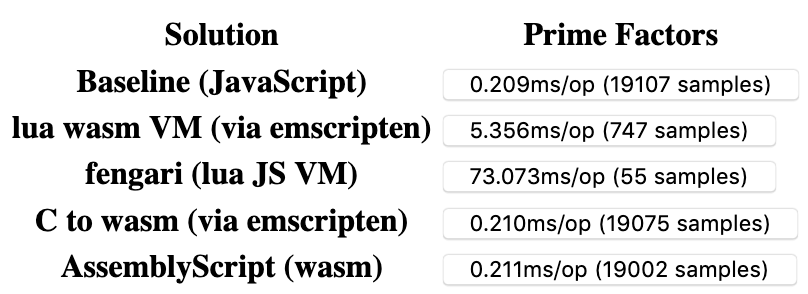

# In-browser sandboxed scripting benchmark

This is a benchmark of various possible solutions to run untrusted third-party code in a web browser.

## The problem

Say you want to extend your web app with scripting capabilities, but you want these scripts to run in a sandbox so that you can control exactly what the script is allowed to do.

A naïve approach consists in exposing the built-in JS runtime of the browser with something like `new Function` or the evil eval. But this is inherently unsafe because the JS runtime of the browser contains many APIs which you may want not want the script to access.

## Evaluated solutions

The following solutions were evaluated:

### Raw JavaScript (baseline)

This just accepts raw JavaScript and instantiates it with `new Function`. It is unsafe and so it does not qualify as a solution per se. It is just here to provide a baseline in the benchmrak.

### lua wasm VM

This solution exposes lua code which is run on the stock lua virtual machine v5.4 compiled to wasm via emscripten. The setup is as follows: The lua VM is compiled ahead of time with the rest of the web application. The web application instantiates the virtual machine in WebAssembly when needed, and feeds it custom bits of lua code to run.

This solution has two layers of sandboxing: The first layer is the lua VM itself, the second layer is the WebAssembly context. Thus, it should be relatively difficult to escape.

### fengari (lua JS VM)

fengari is a lua Virtual Machine implemented in pure JavaScript. The solution here is very similar to the previous one, except that instead of running in webassembly, the VM runs in a regular JavaScript context.

This solution is sandboxed by virtue of the lua Virtual Machine. The lua script can only access the APIs loaded into the VM. Escaping the lua VM would lead directly into the JS runtime (no second abstraction layer as with the wasm solution), but it is unknown how feasible such escape would actually be.

### C to wasm

Low-level C code compiled to webassembly. In this benchmark, C code is precompiled. In practice, the web application should embed the entire emscripten toolchain to compile the user-provided C code into WASM, which might be relatively heavy and slow. Compilation performance was not evaluated in this benchmark. We assume precompiled chunks of WASM.  
Depending on the application, C might be considered too low-level for scripting capabilities. It is mainly included in this benchmark to serve as a baseline for best performance achievable in WASM.

Sandboxing is provided by the WebAssembly context. If features were to be added to WebAssembly in the future to expose the DOM or main JS context APIs by default, then security would be compromised.

### AssemblyScript

AssemblyScript, pre-compiled to WASM chunks. In practice, the app should include the entire compiler toolchain in order to compile user-provided AssemblyScript code into WASM. [A browser SDK](https://github.com/AssemblyScript/assemblyscript/tree/master/lib/sdk) is provided by the AssemblyScript project, but at the moment it seems to be experimental and difficult to embed effectively.

Sandboxing is provided by the WebAssembly context. If features were to be added to WebAssembly in the future to expose the DOM or main JS context APIs by default, then security would be compromised.

## Benchmark

Currently, only one benchmark is implemented:

A naive and inefficient algorithm for finding the prime factors of a number takes a number as input and returns an array of numbers as output.  
This test focuses on raw CPU power. The workload is designed to make I/O overhead to enter and exit the guest context negligible.
Some implementations (eg. C) set hard limits for the output array to avoid having to deal with dynamic sized data structures, given that on this workload the overhead of dynamic data structures is negligible.

## Results

  
_Results obtained in Firefox 82.0 on a mid 2015 MacBook PRO. Results are stable, and similar values were obtained in Chrome._

For prime number factorization, the baseline and all "bare metal" wasm solutions achieve the same performance of around 200uS per unit of work.

Unsurprisingly, VM-based solutions are orders of magnitude solwer than bare wasm. With lua in wasm VM coming at 25x slower than baseline, and fengari almost 350x slower than baseline!

What's somewhat surprising, is that lua on WASM VM comes so far behind raw JavaScript. Both are scripting languages running in a virtual machine, so one would expect them to achieve comparable performance.
However, WASM isn't x86 bare metal, so the native browser JS VM has a head start on the lua VM. What's more, JavaScript is a much more heavily optimized language than lua. Chances are that the simple JS function gets JIT-ed by the web browser, while the lua counterpart stays interpreted from start to finish.

If extreme performance is not a concern, then lua-in-wasm should be the prefered option. Browser compatibility for wasm is quite good nowadays, and this solution is not significantly more difficult to operate than fengari once the VM has been compiled. The hard part really is making the right calls to the lua API to run the code and pass arguments to the VM. At the end of the day, lua-in-wasm is around 14x faster than fengari in this specific benchmark, which is a non trivial speedup.  
Where fengari could have an edge over lua-in-wasm is when running small tasks with lots of calls and heavy data transfers between the host and guest. These aspects have not been benchmarked yet.

If prime performance is a concern, then AssemblyScript squeezes out every last bit of performance out of wasm and runs as fast as un-sandboxed raw JS. The difficult part is to fit and use the compilation toolchain in the app. By inspecting [webassembly.studio](https://webassembly.studio/), it appears that the complete toolchain weighs a little over 1MB of gzipped code, or 6MB uncompressed, which is actually not that bad considering what it does.  
By comparison, the lua VM compiled with emscripten is 390kB with all lua libs included and shrinks down to below 300kB without libs, including 140kB consumed by the very "airy" JavaScript bootstrapping file. A build including a reasonable subset of libraries for basic scripting amounts to 106kB gzipped, or 1/10th of the AssemblyScript toolchain.

I'd be interested to see if lua code can be compiled directly down to webassembly. Perhaps with a transformation from lua bytecode to wasm with a runtime. But the heaviest part of AssemblyScript is the binaryen compiler backend, wich a lua-to-wasm solution would likely need as well, thus it would end up being as heavy as AssemblyScript.

## Not benchmarked / future work

- Benchmark the cost of intensive function calls over the guest/host interface
- Benchmark the cost of heavy data transfers over the interface
- JavaScript-in-JavaScript or JavaScript-in-wasm runtimes
